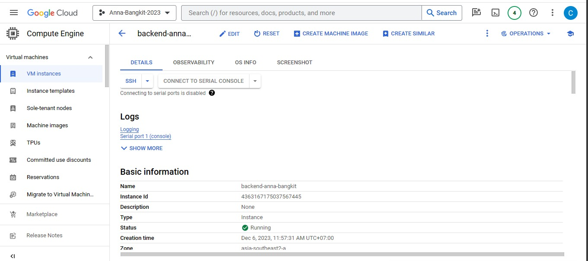

# Anna : Cloud Computing

## 📑 Description

This project aims to guide someone to improving their English communication skills. Leveraging advanced technologies like Natural Language Processing (NLP) and Machine Learning (ML), the team plans to create an interactive and effective language learning environment for users. The application will utilize ChatGPT-4 for NLP and incorporate speech recognition for ML, including speech-to-text functionality.

## 📚 Related Project Repositories

|    Learning Paths     |                           Link                           |
| :-------------------: | :------------------------------------------------------: |
|  🤖 Machine Learning  | [ML Repository](https://github.com/Anna-Bangkit-2023/ML) |
| 📱 Mobile Development | [MD Repository](https://github.com/Anna-Bangkit-2023/MD) |

## ☁️ Cloud Computing : Rest API use Laravel 10 and Deploy to Computed Engine

Implement Rest API to send Audio from Mobile Application to Machine Learning in the backend using Laravel 10 and integrate into Rest API Chat-GPT to automatically reply to audio transcripts from Machine Learning, then create authentication endpoints and chat rooms. Also build the architecture using Google Cloud Platform by using Compute Engine VM Service for BackEnd and Cloud Run for deploying the Machine Learning Model.

## 📚 Libraries Used

This project utilizes several PHP libraries for Auth Handling, and File Storage:

| Library                            | Purpose                                                |
| ---------------------------------- | ------------------------------------------------------ |
| `Auth Sanctum`                     | Develop Authentication for Login, Register and Logout. |
| `League GoogleCloudStorageAdapter` | Connect to Google Storage Bucket.                      |
